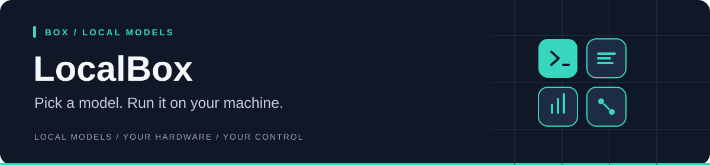

<div align="center">
  <h1>LocalBox</h1>
  <p><strong>Run local AI models and connect them to your coding assistant.</strong></p>
  <p><a href="#install-localx">Install</a> · <a href="#run-your-first-model">First use</a> · <a href="#updates-and-troubleshooting">Updates &amp; help</a> · <a href="docs/README.md">All guides</a></p>
  <p>
    
    
    
    
  </p>
</div>

LocalBox turns a local model into something you can actually use for coding. It
starts `llama-server`, chooses safe settings for your hardware and model, and
connects the result to Claude Code, Codex, or
[LocalPilot](https://github.com/C0deGeek-dev/LocalPilot).

| At a glance | |
|---|---|
| **Use it when** | You want to run an AI model on your own computer |
| **It handles** | Model downloads, starting and stopping servers, hardware-fit hints, and agent setup |
| **You control** | Which model runs, its settings, and which coding agent it connects to |
| **Runs on** | Windows, Linux, and macOS — a single native binary, run from any shell |

<a name="quick-start"></a>

## Install LocalX

**No programming tools or compilation required.** The installer downloads ready-to-run
applications and checks their SHA-256 checksums. You get **LocalBox, LocalPilot,
LocalMind, and LocalBench**, plus `localx` for managing them and the llama.cpp
engine for running models. You do not need to clone this repository.

### 1. Run the installer

**Windows 10/11 (64-bit Intel or AMD):** open the Start menu, type **PowerShell**,
and open it. Paste this command, then press **Enter**:

```powershell
irm https://raw.githubusercontent.com/C0deGeek-dev/LocalPilot/main/install/install.ps1 | iex
```

**Linux (x86-64 or ARM64) / macOS (Apple Silicon):** open **Terminal**, paste
this command, then press **Enter**:

```sh
curl -fsSL https://raw.githubusercontent.com/C0deGeek-dev/LocalPilot/main/install/install.sh | sh
```

### 2. Let your terminal find the commands

`PATH` is the list of folders your terminal searches for applications. Add the
LocalX folder once so commands such as `localx update` work from any directory.

<details>
<summary><strong>Windows — paste this into the same PowerShell window</strong></summary>

```powershell
$localxBin = Join-Path $env:LOCALAPPDATA 'localx\bin'
$userPath = [Environment]::GetEnvironmentVariable('Path', 'User')
if (($userPath -split ';') -notcontains $localxBin) {
    [Environment]::SetEnvironmentVariable('Path', "$localxBin;$userPath", 'User')
}
$env:Path = "$localxBin;$env:Path"
```

This enables the commands in this window and saves the setting for future
terminals. If another open terminal cannot find them, close and reopen it.

</details>

<details>
<summary><strong>Linux / macOS — add LocalX to your shell's PATH</strong></summary>

Paste this into your terminal:

```sh
export PATH="${XDG_DATA_HOME:-$HOME/.local/share}/localx/bin:$PATH"
```

To keep it for future terminals, add the same line to your shell configuration:
`~/.bashrc` for Bash or `~/.zshrc` for Zsh. Use the directory printed by the
installer if it differs.

</details>

### 3. Check the installation

```sh
localx status
```

You should see the installed tools and engine. **Installing the tools does not
download an AI model**; choose one when you start using LocalBox.

Want to read the installer before running it, check platform support, or install
a specific version? See the [installation guide](https://github.com/C0deGeek-dev/LocalPilot/blob/main/docs/install.md).

## Run your first model

Open a terminal in the project folder you want to work on, then run:

```sh
localbox
```

The guided launcher lets you **pick or add a model → choose an agent → review
settings → launch**. Choose **LocalPilot** for the coding agent included with
LocalX, or select another supported agent you already have installed.

Models are separate downloads and can take substantial disk space. Read the
picker's hardware-fit hints before launching; model size and settings determine
how much memory you need.

Prefer simple text menus? Run `localbox --plain`.

| The four LocalX tools | What you get |
|---|---|
| **LocalBox** | Download and run local models |
| **LocalPilot** | Code with the model you choose |
| **LocalMind** | Keep reviewed lessons from your work |
| **LocalBench** | Measure and tune model performance |

## Updates and troubleshooting

| I want to… | Run |
|---|---|
| Update the whole stack and model engine | `localx update` |
| See installed versions | `localx status` |
| Diagnose installation problems | `localx doctor` |
| Retry an incomplete installation | `localx install` |

Ordinary installs use published releases; updates do not require Rust or Git.
If a command is “not recognized” or “not found”, complete the PATH step above.
If an older installation is taking precedence, `localx doctor` identifies it;
review its findings before using `localx doctor --fix` to remove old copies.

## Privacy by design

LocalBox runs your model on hardware you control and keeps the normal inference
path local.

- **No usage telemetry is sent.** LocalBox does not report your prompts, code,
  models, hardware measurements, or usage to us.
- **Your runtime data stays yours.** Models, profiles, logs, and generated
  configuration remain on the machine and paths you choose.
- **Network access is deliberate.** Model or runtime downloads happen only when
  you request them; exposing a server beyond loopback is an explicit, guarded
  action.
- **You remain in control.** The configuration is readable, portable, and yours
  to inspect, back up, move, or delete.

> [!IMPORTANT]
> LocalBox uses `llama-server`. Ollama support ended after the
> [`ollama-classic`](https://github.com/C0deGeek-dev/LocalBox/tree/ollama-classic)
> tag.

## Everyday commands

| Goal | Command |
|---|---|
| Pick or add a model interactively | `localbox` |
| Guided launcher with plain-text menus | `localbox --plain` |
| Launch a model into Claude Code | `localbox launch <model>` |
| Run through LocalPilot | `localbox launch <model> --agent localpilot` |
| Run through Codex | `localbox launch <model> --agent codex` |
| Serve headless (no agent) | `localbox serve <model>` |
| List the configured models | `localbox info` |
| Serve health and the remedy | `localbox status` |
| Stop everything | `localbox stop` |

Model aliases come from the catalog, so the exact list on your machine may be
different. `localbox help` is the source of truth for the installed command
surface.

## What LocalBox does for you

- Chooses the correct chat template, parser, sampler, stop set, and reasoning
  policy for each supported model family.
- Flags a weight-vs-VRAM fit estimate for each model in the picker
  (green/yellow/red) so you can spot a combination likely to run out of VRAM
  before you launch. The estimate is advisory — it colours the choice, it does
  not block the launch.
- Keeps every launch path — `launch`, `serve`, and guided launches alike —
  predictable with single-session server defaults and prompt-cache reuse.
- Sets up one consistent dispatch path for Claude Code, Codex, LocalPilot, and
  plain server mode.
- Saves measured [LocalBench](https://github.com/C0deGeek-dev/LocalBench)
  recommendations as reusable AutoBest profiles, while refusing future
  measurement versions and letting you re-tune or honestly adopt an older
  tune's runnable settings with provenance intact.

```text
GGUF model ──> LocalBox ──> llama-server ──> Claude Code / Codex / LocalPilot
                    │
                    └── VRAM fit hints, templates, parsers, cache and sampling
```

## Choose your next guide

| I want to… | Read |
|---|---|
| Install or repair LocalBox | [Install](docs/install.md) |
| Upgrade from a 1.x install | [Install → Upgrading from 1.x](docs/install.md#upgrading-from-1x) |
| Learn the day-to-day flags | [Usage](docs/usage.md) |
| Connect a coding-agent harness | [Harness mode](docs/harness-mode.md) |
| Add or size a model | [Model management](docs/model-management.md) |
| Tune a model automatically | [Auto-tuner](docs/auto-tuner.md) and [AutoBest profiles](docs/autobest-profile.md) |
| Configure a machine | [Settings](docs/settings.md) |
| Choose a llama.cpp runtime mode | [llama.cpp modes](docs/llamacpp-modes.md) |
| Understand the repository | [Architecture](docs/architecture.md) |
| Fix a problem | [Troubleshooting](docs/troubleshooting.md) |

## LocalX

LocalBox is the runtime layer in the
[LocalX toolchain](https://c0degeek-dev.github.io/LocalStack/):

| Project | Role |
|---|---|
| **LocalBox** | Run local models |
| [LocalBench](https://github.com/C0deGeek-dev/LocalBench) | Find fast, stable settings |
| [LocalPilot](https://github.com/C0deGeek-dev/LocalPilot) | Code through the agent harness |
| [LocalMind](https://github.com/C0deGeek-dev/LocalMind) | Turn reviewed sessions into reusable project memory |

Release history lives in [CHANGELOG.md](CHANGELOG.md).

<details>
<summary><strong>Build from source (developers only)</strong></summary>

The ready-to-run installation above is sufficient for normal use. Building from
source requires Rust and the platform build tools. Run these commands from the
repository checkout unless a clone command is shown:

```sh
cargo install --path crates/localbox --locked
```

</details>

## License


LocalX-owned source is available under the
[PolyForm Noncommercial License 1.0.0](LICENSE). Commercial use requires a
separate license. See [LICENSING.md](LICENSING.md) for the commercial contact,
the 30 August 2026 licensing boundary, and third-party terms.
